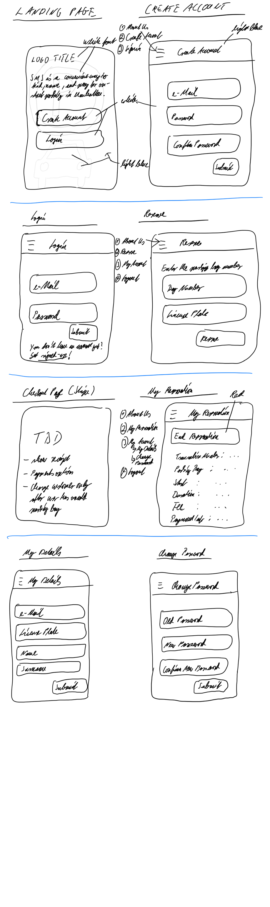

# Secure-My-Spot: Front-End

## TLDR
[tbd]

## Set-up & Installation for Local Development
[tbd]

## User Stories
- Reserve a road-side parking spot which is unoccupied
- Release / cancel reservation for parking spot (only pay for time used)
- Find all available parking spots nearby
- Reserve available parking spots (before physically driving there)
- Flat-rate prices, pro-rated on a minute-by-minute basis
- Database consistency must guarantee a reservation cannot be made more than once at a time
- Checkout / pay for reservation

## Links
### Front-end
- [Deployed app](https://secure-my-spot-client.herokuapp.com)
- [Github repo](https://github.com/sven-gerlach/secure-my-spot-client)
- [Kanban](https://github.com/sven-gerlach/secure-my-spot-client/projects/1)
### Back-end
- [Deployed app](https://secure-my-spot-api.herokuapp.com)
- [Github repo](https://github.com/sven-gerlach/secure-my-spot-api)
- [Kanban](https://github.com/sven-gerlach/secure-my-spot-api/projects/1)

## Technologies
[tbd]

## Public / Private Routes Summary
[tbd]

## ERD

